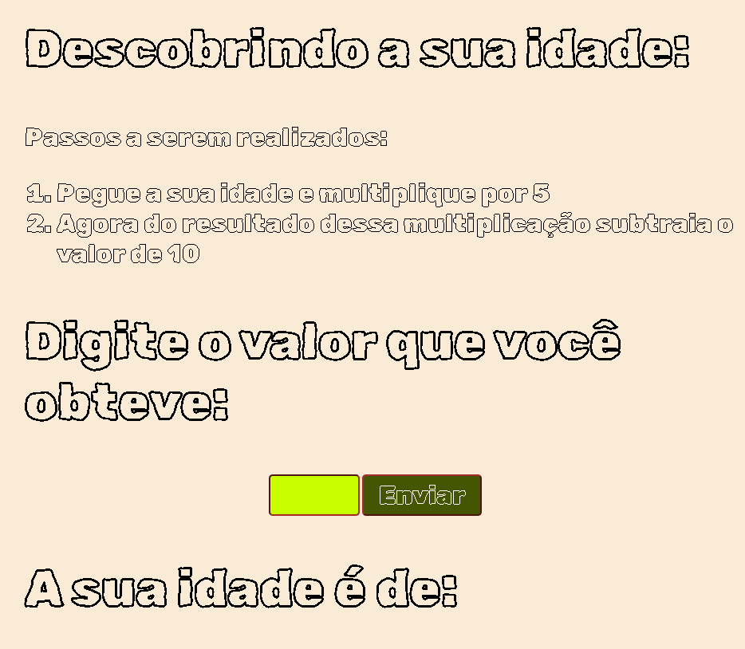

# Magicas Euclidianas

**Mágicas Euclidianas - Projeto Desenvolvido para a Faculdade SESI de Educação - Na Matéria Genêros Acadêmicos Na Lingua Portuguesa**

**Projeto criado para descobrir a idade de uma pessoa, mês de nascimento, dia de nascimento**

   
   
   
   
   
   
   

Autor: Erick Leite Freire 
Criado em: 14-04-2024 
Site: [Erick Freire](https://www.erickfreire.com.br) 
